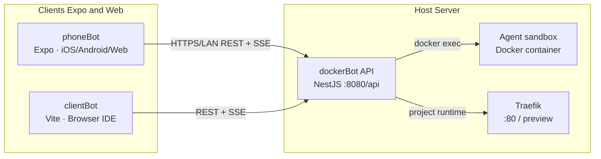

# dockerBot · phoneBot · clientBot — Architecture & Usage Guide

Chinese version: [`dockerBot-phoneBot-clientBot-stack.zh-CN.md`](./dockerBot-phoneBot-clientBot-stack.zh-CN.md)

This article describes how the three subprojects in an AI agent system—featuring fully automated development and one-click deployment—collaborate with each other: the **NestJS backend** (`dockerBot`), the **Expo/React Native mobile client** (`phoneBot`), and the **Vite/React web IDE** (`clientBot`). All clients talk to the same HTTP API exposed by dockerBot (`/api/...`).

### One-line product introductions

| Project | Introduction |
| --- | --- |
| **dockerBot** | An AI agent system with fully automated development and one-click deployment. 
Provide a Git repository and access token, and I’ll handle the full-stack development and deployment for you. |
| **phoneBot** | Anytime, anywhere—pull out your phone and get development done. |
| **clientBot** | A web-based intelligent IDE with one-click full-stack deployment support. |

### Upstream repositories (GitHub)

| Project | Repository |
| --- | --- |
| **dockerBot** | [github.com/jsCanvas/dockerBot](https://github.com/jsCanvas/dockerBot) |
| **phoneBot** | [github.com/jsCanvas/phoneBot](https://github.com/jsCanvas/phoneBot) |
| **clientBot** | [github.com/jsCanvas/clientBot](https://github.com/jsCanvas/clientBot) |

---

## 1. High-level relationship



| Package | GitHub | Path in this workspace | Primary role |
| --- | --- | --- | --- |
| **dockerBot** | [jsCanvas/dockerBot](https://github.com/jsCanvas/dockerBot) | `task/dockerBot/` | Authoritative backend: projects, Git, files, encrypted model configs, multi-turn chat with **SSE**, agent runs in a **sandbox container**, MCP/Skills, Docker runtime orchestration via host `docker.sock`, Traefik-friendly previews. |
| **phoneBot** | [jsCanvas/phoneBot](https://github.com/jsCanvas/phoneBot) | `task/phoneBot/` | First-party **mobile/desktop-style** UI (Expo): six tabs mapped 1:1 to dockerBot routes. Ships the canonical TypeScript modules shared with clientBot (`api/`, `hooks/`, `chat/`, `types/`, etc.). |
| **clientBot** | [jsCanvas/clientBot](https://github.com/jsCanvas/clientBot) | `task/clientBot/` | **Web IDE** (VS Code–like shell): Monaco editor, file tree, terminal/output panels, sidebar chat with `@`/`/` mentions — reuses phoneBot logic via path alias **`@phoneBot/*`**. |

**Important naming note.** The Compose stack still uses identifiers such as `PHONEBOT_*` env vars, `phonebot-api`/`phonebot-agent` container names, and the npm package name `phonebot` inside `dockerBot/package.json`. These are **legacy infrastructure labels**. Product and documentation wording for “the orchestration service” is **dockerBot**. Do not confuse the folder `phoneBot/` (the **client app**) with those env prefixes (the **server** deployment).

---

## 2. dockerBot (backend)

### 2.1 What it is

dockerBot is a **NestJS** application packaged with Docker Compose alongside:

- a long-lived **agent sandbox** image (Claude Code, router, toolchain),
- **Traefik** for routing preview URLs (`<slug>.<BASE_DOMAIN>`).

Persistence is SQLite under the configured data directory (`PHONEBOT_DATA_DIR`, default `./data`). Model credentials and sensitive fields are encrypted at rest (AES-256-GCM) using `PHONEBOT_ENCRYPTION_KEY` (64 hex chars).

### 2.2 Prerequisites

- Docker Engine / Docker Desktop with **Compose V2**
- `openssl` (used by `./scripts/start.sh` when generating keys)

### 2.3 First-time setup & run

From `dockerBot/`:

```bash
cp .env.example .env
# Ensure PHONEBOT_ENCRYPTION_KEY is set to 32-byte hex if not auto-filled by start.sh.

./scripts/start.sh          # foreground: build + attach to compose logs
# ./scripts/start.sh -d      # detach (background)
./scripts/start.sh down     # stop and remove compose stack containers
```

- **REST base URL:** `http://localhost:8080/api` (or your host/IP + `/api`).
- Traefik dashboard (local profile) is referenced in `scripts/start.sh` output (commonly `:8081`).

For API tables, curls, security notes, and npm scripts (`npm run start:dev`, tests, lint), see **`dockerBot/README.md`** and design notes under **`docs/plans/`** (e.g. `2026-04-28-dockerBot-design.md` when present).

### 2.4 What clients must configure

Clients only need a single **API base URL** string that ends with `/api`:

- LAN example: `http://192.168.1.10:8080/api`
- Typical local dev behind Vite proxy: `http://127.0.0.1:5173/api` (see clientBot §4.4)

---

## 3. phoneBot (Expo mobile / multi-platform client)

### 3.1 What it is

phoneBot is an **Expo (React Native)** application. It targets **iOS, Android, and web** (`npm run web`). It remains the **source of truth** for shared TS modules consumed by clientBot (`PhoneBotApiClient`, SSE streaming hook `useAgentSession`, chat payloads, mentions, settings storage interfaces, API DTO types).

Despite the historical name **`PhoneBotApiClient`**, the HTTP server is dockerBot — the client is naming from the codebase era, not a separate backend product.

### 3.2 Install & run

```bash
cd phoneBot
npm install
npm run web           # fastest on a laptop browser
npm start             # Expo Dev Tools for device/simulator
```

### 3.3 Pointing at the backend

In **Settings → dockerBot connection**:

- Set **dockerBot API Base URL** to e.g. `http://HOST:8080/api`.
- On a physical phone, use your machine’s LAN IP if the backend runs on your PC.

Persisted JSON lives in AsyncStorage under key **`phonebot.client.settings`** (same logical shape as web `clientBot`; see §4).

### 3.4 Verify

```bash
npm run typecheck
npm test
```

Tab ↔ endpoint mapping is documented in **`phoneBot/README.md`**.

### 3.5 Screenshots (phoneBot UI)

| Settings | Projects | Chat | Files |
| :---: | :---: | :---: | :---: |
|  |  |  |  |

| Preview | Docker runtime | Git |
| :---: | :---: | :---: |
|  |  |  |

---

## 4. clientBot (Web IDE)

### 4.1 What it is

clientBot is a **Vite + React 18** SPA styled like an IDE:

- Activity bar & explorer
- Monaco for UTF-8 text files
- Bottom panels (_OUTPUT_, terminal strip, ports/runtime)
- Right-side chat wired to **`useAgentSession`** and dockerBot SSE

It **does not duplicate** networking logic: **`tsconfig`** and **`vite.config.ts`** map `@phoneBot/*` → `../phoneBot/src/*`. A small shim replaces `@react-native-async-storage/async-storage` for builds.

#### Screenshot — clientBot Web IDE


_The screenshot shows file tree & runtime hints, centered code editing, Docker/ports tooling with preview, and the SSE-backed assistant—with skills such as `docker-runtime` / `fullstack-scaffold` in context._

### 4.2 Install & run

```bash
cd clientBot
npm install
npm run dev      # http://localhost:5173 (default port in vite.config)
npm run build
npm run preview
```

### 4.3 Workspace settings UX

The app opens a **Workspace settings** modal:

- **Connection:** API Base URL draft + save (against dockerBot).
- **Project / Models:** same CRUD flows as mobile (hosted REST on dockerBot).

Web persistence uses **`localStorage`** via `WebPersistence`, key **`phonebot.client.settings`** (mirrors AsyncStorage-backed settings shape).

### 4.4 Vite proxy (recommended local pairing)

```text
clientBot/vite.config.ts
  proxy: { '/api' → http://127.0.0.1:8080 }
```

Therefore you may set Connection to **`http://127.0.0.1:5173/api`** so the browser only talks to Vite while developing; Vite forwards `/api/*` to dockerBot `:8080`. Avoid `localhost` in some sandboxed setups if `/etc/hosts` resolution differs — `127.0.0.1` is predictable.

### 4.5 Internationalization

Default UI language is **English** with optional **Chinese (zh-CN)**; locale is persisted (see `clientBot/src/i18n/`).

### 4.6 Shared modules (mental model)

| Shared area (under `phoneBot/src/`) | Typical use in clientBot |
| --- | --- |
| `api/phoneBotApi.ts` | HTTP + multipart |
| `hooks/useAgentSession.ts` | SSE chat stream |
| `chat/` | payloads, `@`/`/` completions |
| `screens/screenActions.ts`, `screens/fileTree.ts` | project/session/actions |
| `types/api.ts` | DTOs |

---

## 5. Typical end-to-end workflows

### 5.1 Local: backend + web IDE only

1. Start dockerBot (`./scripts/start.sh` or `./scripts/start.sh -d`).
2. In clientBot Connection, use `http://127.0.0.1:8080/api` **or** `http://127.0.0.1:5173/api` if using the Vite proxy.
3. Create/select a **project**, attach a **model config**, create a **session**, chat — files appear under the explorer from dockerBot file APIs.

### 5.2 Local: backend + phone

1. Start dockerBot; bind `:8080` on `0.0.0.0` or use LAN IP forwarding.
2. phoneBot Settings → dockerBot API Base URL → `http://<LAN-ip>:8080/api`.

### 5.3 Stopping workloads

| Goal | Command / action |
| --- | --- |
| Stop Compose stack hosting dockerBot API + sandbox + Traefik | `cd dockerBot && ./scripts/start.sh down` |
| Restart stack | `./scripts/start.sh restart` |
| Inspect logs | `./scripts/start.sh logs -f api` (passthrough — see script header) |
| Shut down Expo / Vite | Ctrl+C in the respective dev terminal |

---

## 6. Further reading

| Topic | Location |
| --- | --- |
| dockerBot features, curls, npm scripts | `dockerBot/README.md` |
| phoneBot tab ↔ API map, streaming notes | `phoneBot/README.md` |
| Detailed implementation plans | `docs/plans/*.md` |
| Built-in Skills (Docker runtime scaffold, etc.) | `dockerBot/src/skills/builtin/*.md` |

---

## 7. Changelog discipline

When adding features that touch REST or SSE contracts, prefer updating **dockerBot server**, then **shared types/usages under `phoneBot/src`**, then **clientBot** if only UI/strings change. Keeps `@phoneBot` imports type-correct across both clients.
