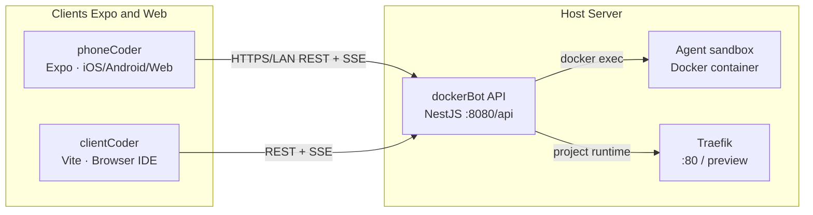

# [dockerBot](https://github.com/jsCanvas/dockerBot) · [phoneCoder](https://github.com/jsCanvas/phoneCoder) · [clientCoder](https://github.com/jsCanvas/clientCoder) — Architecture & Usage Guide

Chinese version: [`dockerBot-phoneCoder-clientCoder-stack.zh-CN.md`](./dockerBot-phoneBot-clientBot-stack.zh-CN.md)

This article describes how the three subprojects in an AI agent system—featuring fully automated development and one-click deployment—collaborate with each other: the **NestJS backend** (`dockerBot`), the **Expo/React Native mobile client** (`phoneCoder`), and the **Vite/React web IDE** (`clientCoder`). 
Provide a Git repository and access token, and the system will take care of full-stack development and deployment, with mobile support so you can build anytime, anywhere—right from your phone.

### Upstream repositories (GitHub)

| Project | Repository |
| --- | --- |
| **dockerBot** | [github.com/jsCanvas/dockerBot](https://github.com/jsCanvas/dockerBot) |
| **phoneCoder** | [github.com/jsCanvas/phoneCoder](https://github.com/jsCanvas/phoneCoder) |
| **clientCoder** | [github.com/jsCanvas/clientCoder](https://github.com/jsCanvas/clientCoder) |

---

## 1. High-level relationship



| Package | GitHub | Introduction | Primary role |
| --- | --- | --- | --- |
| **dockerBot** | [jsCanvas/dockerBot](https://github.com/jsCanvas/dockerBot) | An AI agent system with fully automated development and one-click deployment. Provide a Git repository and access token, and I’ll handle the full-stack development and deployment for you. | Authoritative backend: projects, Git, files, encrypted model configs, multi-turn chat with **SSE**, agent runs in a **sandbox container**, MCP/Skills, Docker runtime orchestration via host `docker.sock`, Traefik-friendly previews. |
| **phoneCoder** | [jsCanvas/phoneCoder](https://github.com/jsCanvas/phoneCoder) | Anytime, anywhere—pull out your phone and get development done. | First-party **mobile/desktop-style** UI (Expo): six tabs mapped 1:1 to dockerBot routes. Ships the canonical TypeScript modules shared with clientCoder (`api/`, `hooks/`, `chat/`, `types/`, etc.). |
| **clientCoder** | [jsCanvas/clientCoder](https://github.com/jsCanvas/clientCoder) | A web-based intelligent IDE with one-click full-stack deployment support. | **Web IDE** (VS Code–like shell): Monaco editor, file tree, terminal/output panels, sidebar chat with `@`/`/` mentions — reuses phoneCoder logic via path alias **`@phoneCoder/*`**. |

---

## 2. dockerBot (backend)

### 2.1 What it is

dockerBot is a **NestJS** application packaged with Docker Compose alongside:

- a long-lived **agent sandbox** image (Claude Code, router, toolchain),
- **Traefik** for routing preview URLs (`<slug>.<BASE_DOMAIN>`).

Persistence is SQLite under the configured data directory (`phoneCoder_DATA_DIR`, default `./data`). Model credentials and sensitive fields are encrypted at rest (AES-256-GCM) using `phoneCoder_ENCRYPTION_KEY` (64 hex chars).

### 2.2 Prerequisites

- Docker Engine / Docker Desktop with **Compose V2**
- `openssl` (used by `./scripts/start.sh` when generating keys)

### 2.3 First-time setup & run

From `dockerBot/`:

```bash
cp .env.example .env
# Ensure phoneCoder_ENCRYPTION_KEY is set to 32-byte hex if not auto-filled by start.sh.

./scripts/start.sh          # foreground: build + attach to compose logs
# ./scripts/start.sh -d      # detach (background)
./scripts/start.sh down     # stop and remove compose stack containers
```

- **REST base URL:** `http://localhost:8080/api` (or your host/IP + `/api`).
- Traefik dashboard (local profile) is referenced in `scripts/start.sh` output (commonly `:8081`).

For API tables, curls, security notes, and npm scripts (`npm run start:dev`, tests, lint), see **[dockerBot/design.md](https://github.com/jsCanvas/dockerBot/blob/main/design.md)**

### 2.4 What clients must configure

Clients only need a single **API base URL** string that ends with `/api`:

- LAN example: `http://192.168.1.10:8080/api`
- Typical local dev behind Vite proxy: `http://127.0.0.1:5173/api` (see clientCoder §4.4)

---

## 3. phoneCoder (Expo mobile / multi-platform client)

### 3.1 What it is

phoneCoder is an **Expo (React Native)** application. It targets **iOS, Android, and web** (`npm run web`). It remains the **source of truth** for shared TS modules consumed by clientCoder (`PhoneBotApiClient`, SSE streaming hook `useAgentSession`, chat payloads, mentions, settings storage interfaces, API DTO types).

### 3.2 Install & run

```bash
cd phoneCoder
npm install
npm run web           # fastest on a laptop browser
npm start             # Expo Dev Tools for device/simulator
```

### 3.3 Pointing at the backend

In **Settings → dockerBot connection**:

- Set **dockerBot API Base URL** to e.g. `http://HOST:8080/api`.
- On a physical phone, use your machine’s LAN IP if the backend runs on your PC.

Persisted JSON lives in AsyncStorage under key **`phoneCoder.client.settings`** (same logical shape as web `clientCoder`; see §4).

### 3.4 Verify

```bash
npm run typecheck
npm test
```

Tab ↔ endpoint mapping is documented in **[phoneCoder/design.md](https://github.com/jsCanvas/phoneCoder/blob/main/design.md)**.

### 3.5 Screenshots (phoneCoder UI)

| Settings | Projects | Chat | Files |
| :---: | :---: | :---: | :---: |
|  |  |  |  |

| Preview | Docker runtime | Git |
| :---: | :---: | :---: |
|  |  |  |

---

## 4. clientCoder (Web IDE)

### 4.1 What it is

clientCoder is a **Vite + React 18** SPA styled like an IDE:

- Activity bar & explorer
- Monaco for UTF-8 text files
- Bottom panels (_OUTPUT_, terminal strip, ports/runtime)
- Right-side chat wired to **`useAgentSession`** and dockerBot SSE

It **does not duplicate** networking logic: **`tsconfig`** and **`vite.config.ts`** map `@phoneCoder/*` → `../phoneCoder/src/*`. A small shim replaces `@react-native-async-storage/async-storage` for builds.

#### Screenshot — clientCoder Web IDE


_The screenshot shows file tree & runtime hints, centered code editing, Docker/ports tooling with preview, and the SSE-backed assistant—with skills such as `docker-runtime` / `fullstack-scaffold` in context._

### 4.2 Install & run

```bash
cd clientCoder
npm install
npm run dev      # http://localhost:5173 (default port in vite.config)
npm run build
npm run preview
```

### 4.3 Workspace settings UX

The app opens a **Workspace settings** modal:

- **Connection:** API Base URL draft + save (against dockerBot).
- **Project / Models:** same CRUD flows as mobile (hosted REST on dockerBot).

Web persistence uses **`localStorage`** via `WebPersistence`, key **`phoneCoder.client.settings`** (mirrors AsyncStorage-backed settings shape).

### 4.4 Vite proxy (recommended local pairing)

```text
clientCoder/vite.config.ts
  proxy: { '/api' → http://127.0.0.1:8080 }
```

Therefore you may set Connection to **`http://127.0.0.1:5173/api`** so the browser only talks to Vite while developing; Vite forwards `/api/*` to dockerBot `:8080`. Avoid `localhost` in some sandboxed setups if `/etc/hosts` resolution differs — `127.0.0.1` is predictable.

### 4.5 Internationalization

Default UI language is **English** with optional **Chinese (zh-CN)**; locale is persisted (see `clientCoder/src/i18n/`).

### 4.6 Shared modules (mental model)

| Shared area (under `phoneCoder/src/`) | Typical use in clientCoder |
| --- | --- |
| `api/phoneCoderApi.ts` | HTTP + multipart |
| `hooks/useAgentSession.ts` | SSE chat stream |
| `chat/` | payloads, `@`/`/` completions |
| `screens/screenActions.ts`, `screens/fileTree.ts` | project/session/actions |
| `types/api.ts` | DTOs |

---

## 5. Typical end-to-end workflows

### 5.1 Local: backend + web IDE only

1. Start dockerBot (`./scripts/start.sh` or `./scripts/start.sh -d`).
2. In clientCoder Connection, use `http://127.0.0.1:8080/api` **or** `http://127.0.0.1:5173/api` if using the Vite proxy.
3. Create/select a **project**, attach a **model config**, create a **session**, chat — files appear under the explorer from dockerBot file APIs.

### 5.2 Local: backend + phone

1. Start dockerBot; bind `:8080` on `0.0.0.0` or use LAN IP forwarding.
2. phoneCoder Settings → dockerBot API Base URL → `http://<LAN-ip>:8080/api`.

### 5.3 Stopping workloads

| Goal | Command / action |
| --- | --- |
| Stop Compose stack hosting dockerBot API + sandbox + Traefik | `cd dockerBot && ./scripts/start.sh down` |
| Restart stack | `./scripts/start.sh restart` |
| Inspect logs | `./scripts/start.sh logs -f api` (passthrough — see script header) |
| Shut down Expo / Vite | Ctrl+C in the respective dev terminal |

---

## 6. Further reading

| Topic | Location |
| --- | --- |
| dockerBot features, curls, npm scripts | [dockerBot/design.md](https://github.com/jsCanvas/dockerBot/blob/main/design.md) |
| phoneCoder tab ↔ API map, streaming notes | [phoneCoder/design.md](https://github.com/jsCanvas/phoneCoder/blob/main/design.md) |
| Built-in Skills (Docker runtime scaffold, etc.) | `dockerBot/src/skills/builtin/*.md` |

---

## 7. Full-stack project development & deployment example

### 7.1 Obtain a Git access token

Open **[GitHub personal access tokens](https://github.com/settings/personal-access-tokens)** (Avatar → **Settings** → **Developer settings** → **Fine-grained personal access tokens**).  
Create an access token and grant **Contents** — **Read and write** (**this is required**).


After you have the token, go to the **Projects** tab and create a project.

### 7.2 Develop via multi-turn chat

**Example prompt:**

```
/skill prompt2repo-engineering-rules 
Follow the engineering skill rules: create folder label-2026043014 and implement the project inside label-2026043014 to spec. Below is my product prompt.

Generate a separated frontend/backend web project.

Flower shop management system with a cart-like workflow; include at least one page with an information table (similar to course selection) supporting full CRUD.

The home page must be responsive, with strong UI polish—no broken styles. Use the UI kit’s dialogs and toast/notification APIs; the interface should look deliberate and polished.

Strictly reproduce the UI from the design: Implement this design from Figma.
@https://www.figma.com/design/XXXXXXX?node-id=418-56098&m=dev

Frontend: Vue 3 + Vite + Element Plus; use axios against a REST API. Docker published port and app listen port must be **3000**.

Backend: Java + Spring Boot. Docker published port and app listen port must be **8000**.

Provide database code / migrations or operate the database for me. Use MySQL with Docker published port 3306.
```

If you have no Figma file, drop the Figma URL line from the prompt above.

**Suggested prompt structure:**

1. Full-stack skill: `/skill prompt2repo-engineering-rules`
2. Name the directory/project root the agent should create
3. Product requirements (features, workflows, responsive UI)
4. UI rules / Figma; you can attach a Figma link or use **Figma MCP** when configured
5. Frontend stack plus Docker/host port (**3000** in this example)
6. Backend stack plus Docker/host port (**8000** in this example)
7. Database stack and published port (**3306** here)

**Example outcome:**

| Coding | README | Files | Preview |
| :---: | :---: | :---: | :---: |
|  |  |  |  |

### 7.3 Open files & start Docker runtime

In **Files**, use the Docker icon on the project (or subdirectory) row to start the stack;  
then switch to **Preview** to open the running app.

### 7.4 AI-assisted checklist QA

```
/skill prompt2repo-final-checklist 
Following the checklist, review and validate the full-stack project in label-2026043014
```

**Suggested prompt structure:**

1. QA skill: `/skill prompt2repo-final-checklist`
2. Name the directory / project slice to audit

### 7.5 Commit & push on Git

Open the **Git** tab, run your usual commit/push workflow for the cloned project, and synchronize with the remote repository.

