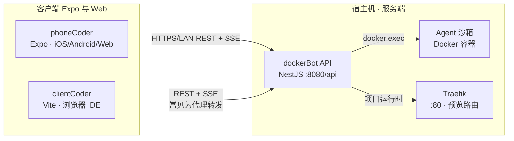
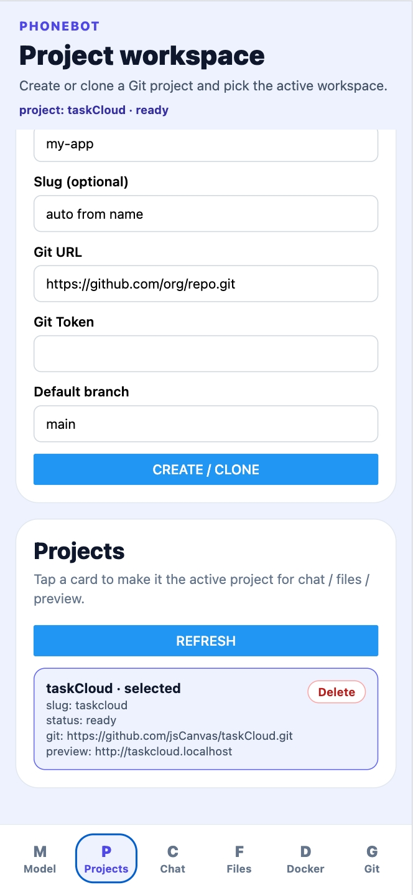
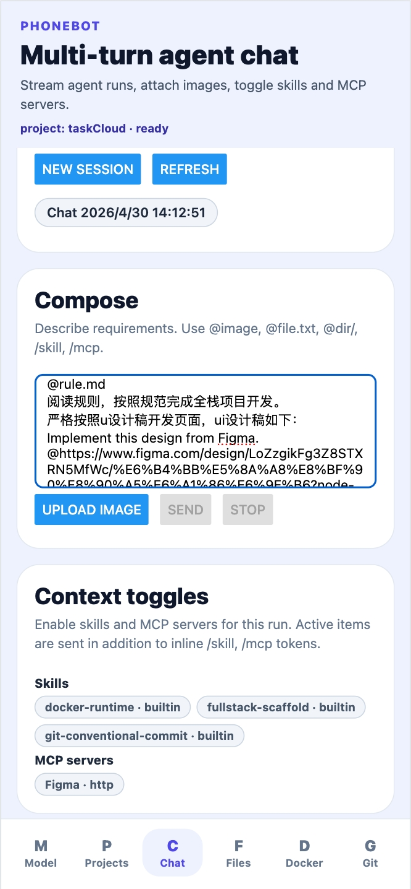
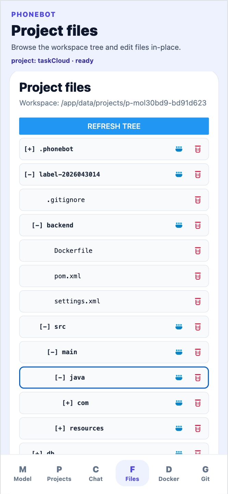
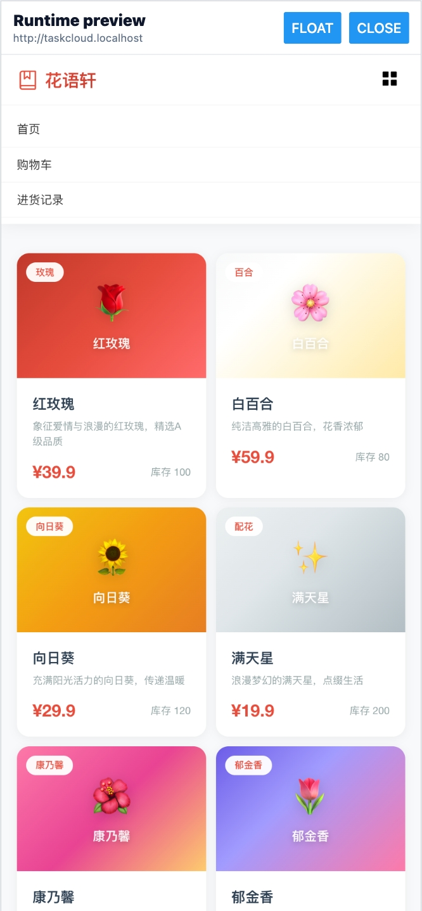
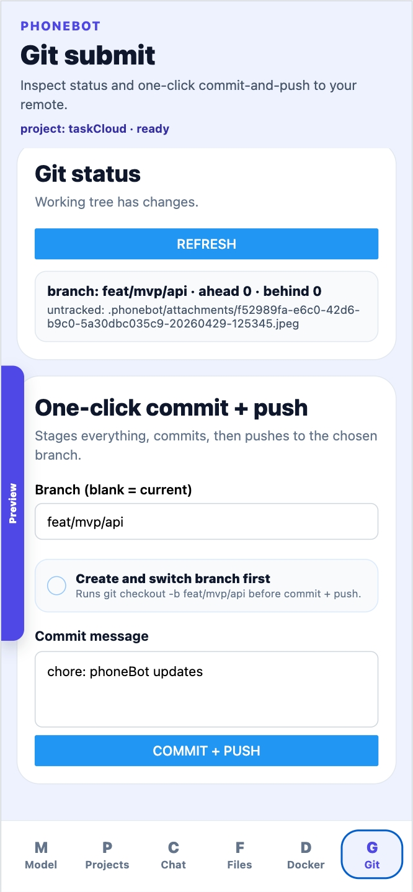
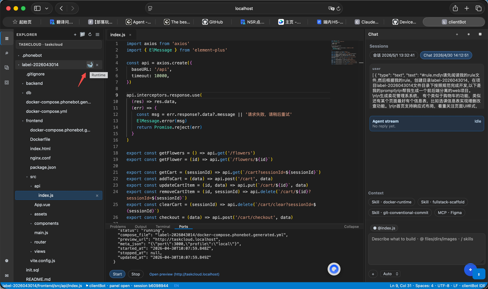

# [dockerBot](https://github.com/jsCanvas/dockerBot) · [phoneCoder](https://github.com/jsCanvas/phoneCoder) · [clientCoder](https://github.com/jsCanvas/clientCoder) — 架构与使用指南（中文版）

本文介绍了一个具备全自动开发和一键部署能力的 AI 智能体系统，其三个子项目：**NestJS 后端**（`dockerBot`）、**Expo / React Native 客户端**（`phoneCoder`）、**Vite / React 网页 IDE**（`clientCoder`）。
只需提供 Git 仓库与访问令牌，即可由系统为你完成全栈开发与部署，并且支持移动端编程，实现随时随地——掏出手机就能完成开发。

> 英文版原文：[dockerBot-phoneCoder-clientCoder-stack.md](https://github.com/jsCanvas/phoneCoder/blob/main/dockerBot-phoneBot-clientBot-stack.md)

### 上游源码仓库（GitHub）

| 项目 | 仓库地址 |
| --- | --- |
| **dockerBot** | [github.com/jsCanvas/dockerBot](https://github.com/jsCanvas/dockerBot) |
| **phoneCoder** | [github.com/jsCanvas/phoneCoder](https://github.com/jsCanvas/phoneCoder) |
| **clientCoder** | [github.com/jsCanvas/clientCoder](https://github.com/jsCanvas/clientCoder) |

---

## 1. 总体关系



| 子项目 | GitHub | 介绍 | 主要职责 |
| --- | --- | --- | --- |
| **dockerBot** | [jsCanvas/dockerBot](https://github.com/jsCanvas/dockerBot) | 具备全自动开发与一键部署能力的 AI 智能体系统。只需提供 Git 仓库与访问令牌，即可由系统为你完成全栈开发与部署。 | **权威后端**：工程与 Git、文件、加密模型配置、面向多轮会话的 **SSE** 聊天、**沙箱容器**内执行 Agent、MCP / Skills、通过宿主 `docker.sock` 编排 Docker 运行时、配合 Traefik 的预览域名等。 |
| **phoneCoder** | [jsCanvas/phoneCoder](https://github.com/jsCanvas/phoneCoder) | 随时随地——掏出手机就能完成开发。 | 官方 **移动/多端** UI（Expo）：六个 Tab 与 dockerBot 路由一一对应；同时托管与 clientCoder 共享的 TypeScript 模块（`api/`、`hooks/`、`chat/`、`types/` 等）。 |
| **clientCoder** | [jsCanvas/clientCoder](https://github.com/jsCanvas/clientCoder) | 支持一键全栈部署的网页智能 IDE。 | **网页 IDE**（类 VS Code 外壳）：Monaco、文件树、输出/终端/端口等面板、侧栏聊天并支持 `@` / `/` 提及；通过路径别名 **`@phoneCoder/*`** 复用 phoneCoder 逻辑。 |

---

## 2. dockerBot（后端）

### 2.1 是什么

dockerBot 是 **NestJS** 应用，通过 Docker Compose 与以下组件一同部署：

- 长期运行的 **Agent 沙箱** 镜像（Claude Code、路由、工具链等）；
- **Traefik**：为预览站点提供形如 `<slug>.<BASE_DOMAIN>` 的路由。

数据持久化采用 SQLite，存放在配置的数据目录下（`phoneCoder_DATA_DIR`，默认 `./data`）。模型凭证等敏感字段使用 `phoneCoder_ENCRYPTION_KEY`（64 位十六进制，即 32 字节）配合 **AES-256-GCM** 加密落盘。

### 2.2 前置条件

- 安装 **Docker Engine / Desktop**，且具备 **Compose V2**（`docker compose` 命令）。
- 系统提供 **`openssl`**（`./scripts/start.sh` 在未配置密钥时可用来生成占位替换）。

### 2.3 初次配置与启动

在 **`dockerBot/`** 目录下：

```bash
cp .env.example .env
# 若 phoneCoder_ENCRYPTION_KEY 仍为占位符，可先交给 start.sh 自动生成，否则请手动填入 32 字节十六进制。

./scripts/start.sh          # 前台：构建镜像并附着到 Compose 日志
# ./scripts/start.sh -d     # 后台 /  detached
./scripts/start.sh down     # 停止并移除本仓库 Compose 启动的容器
```

- **REST 基地址：** `http://localhost:8080/api`（或换成本机局域网 IP + `/api`）。
- Traefik **仪表盘地址**会因配置略有不同，`scripts/start.sh` 的输出里会提示（本地配置常见 `:8081`）。

API 一览、cURL 示例、安全说明及 npm 脚本（如 `npm run start:dev`、测试、lint），详见 **[dockerBot/design.md](https://github.com/jsCanvas/dockerBot/blob/main/design.md)** 。

### 2.4 客户端必填配置项

各客户端仅需配置一项以 **`/api` 结尾** 的 **API Base URL**，例如：

- 局域网：`http://192.168.1.10:8080/api`
- 本地开发常用（经 Vite 代理）：`http://127.0.0.1:5173/api`（见 clientCoder §4.4）

---

## 3. phoneCoder（Expo 多端客户端）

### 3.1 是什么

phoneCoder 为 **Expo（React Native）** 应用，目标平台包括 **iOS、Android 与 Web**（`npm run web`）。它仍是 **共享 TypeScript 模块的源头**：clientCoder 所依赖的 `PhoneBotApiClient`、SSE 流式钩子 `useAgentSession`、聊天负载与提及、`SettingsStorage` 形状、DTO 类型等均定义于此。

### 3.2 安装与运行

```bash
cd phoneCoder
npm install
npm run web           # 在笔记本浏览器中最快验证
npm start             # 打开 Expo CLI，可选真机 / 模拟器
```

### 3.3 指向后端地址

在 **设置 → dockerBot connection**：

- **dockerBot API Base URL** 填例如：`http://主机:8080/api`。
- **手机访问本机后端**时，若 dockerBot 跑在电脑上，请使用电脑的 **局域网 IP**。

配置以 JSON 写入 AsyncStorage，键名 **`phoneCoder.client.settings`**（与 Web 端 `clientCoder` 逻辑等价，参见 §4）。

### 3.4 自检

```bash
npm run typecheck
npm test
```

Tab 与接口对应关系见 **[phoneCoder/design.md](https://github.com/jsCanvas/phoneCoder/blob/main/design.md)**。

### 3.5 phoneCoder 界面截图

| 设置 | 项目 | 聊天 | 文件 |
| :---: | :---: | :---: | :---: |
|  |  |  |  |

| 预览 | Docker 运行时 | Git |
| :---: | :---: | :---: |
|  |  |  |

---

## 4. clientCoder（网页 IDE）

### 4.1 是什么

clientCoder 是一套 **Vite + React 18** 的单页应用，交互布局模仿 IDE：

- 活动栏与资源管理器；
- Monaco 编辑 UTF-8 文本；
- 底部面板（OUTPUT、简易终端条、端口/运行时）；
- 右侧聊天：`useAgentSession` + dockerBot **SSE**。

**不复制**一层网络/SDK：`tsconfig` 与 **`vite.config.ts`** 将 `@phoneCoder/*` 解析到 **`../phoneCoder/src/*`**；并为构建提供 `@react-native-async-storage/async-storage` 的极简 **shim**。

#### 截图 — clientCoder 网页 IDE



_示意：左侧工程树与运行时入口、居中代码编辑、底部端口及预览链路、右侧由 SSE 驱动的助手及 `docker-runtime` / `fullstack-scaffold` 等上下文技能。_

### 4.2 安装与运行

```bash
cd clientCoder
npm install
npm run dev          # 默认 http://localhost:5173（见 vite 配置）
npm run build
npm run preview
```

### 4.3 工作台设置（交互）

应用内提供 **Workspace settings（工作台设置）** 对话框：

- **连接（Connection）：** 编辑 API Base URL 并向 dockerBot 校验/保存；
- **项目 / 模型：** 与移动端相同的 CRUD 流程（全部由 dockerBot 承载）。

浏览器侧持久化经由 `WebPersistence` 写入 **`localStorage`**，键名同样为 **`phoneCoder.client.settings`**（结构上与 AsyncStorage 方案对齐）。

### 4.4 Vite 代理（推荐本地联动）

```text
clientCoder/vite.config.ts
  proxy: { '/api' → http://127.0.0.1:8080 }
```

开发时可将连接地址设为 **`http://127.0.0.1:5173/api`**：浏览器只请求 Vite 开发服务器，由 Vite 将 `/api/*` **转发到** dockerBot 的 `8080` 端口。部分沙箱或对 `localhost` 解析有特殊限制的环境，优先考虑 **`127.0.0.1`**。

### 4.5 国际化

默认界面语言为 **英文**，可选用 **简体中文（zh-CN）**；所选语言会持久保存（参见 `clientCoder/src/i18n/`）。

### 4.6 共享模块心智图

| `phoneCoder/src/` 区域 | clientCoder 中典型用途 |
| --- | --- |
| `api/phoneCoderApi.ts` | HTTP 与 multipart |
| `hooks/useAgentSession.ts` | SSE 聊天流 |
| `chat/` | 负载拼装、`@` / `/` 补全来源 |
| `screens/screenActions.ts`、`screens/fileTree.ts` | 工程切换、会话、文件树合并等 |
| `types/api.ts` | DTO 类型 |

---

## 5. 典型端到端流程

### 5.1 仅本机：后端 + 网页 IDE

1. 启动 dockerBot（`./scripts/start.sh` 或 `./scripts/start.sh -d`）。
2. 在 clientCoder「连接」中填写 `http://127.0.0.1:8080/api`，若走 Vite 代理则用 `http://127.0.0.1:5173/api`。
3. **创建/选择工程** → 绑定 **模型配置** → 新建 **会话** → 在聊天里下达任务；资源管理器中文件列表由 dockerBot 文件接口驱动。

### 5.2 仅本机：后端 + 手机

1. 启动 dockerBot，保证 `:8080` 可被局域网访问（监听 `0.0.0.0` 或配合端口映射）。
2. phoneCoder：**设置 → dockerBot API Base URL** → `http://<局域网IP>:8080/api`。

### 5.3 停止各层进程

| 目标 | 命令 / 操作 |
| --- | --- |
| 关掉承载 API + 沙箱 + Traefik 的 Compose 栈 | `cd dockerBot && ./scripts/start.sh down` |
| 重启栈 | `./scripts/start.sh restart` |
| 查日志（透传给 `docker compose`） | `./scripts/start.sh logs -f api`（详见脚本头部说明） |
| 退出 Expo / Vite | 在对应终端 **Ctrl+C** |

---

## 6.延伸阅读

| 主题 | 位置 |
| --- | --- |
| dockerBot 特性、cURL、npm 脚本 | [dockerBot/design.md](https://github.com/jsCanvas/dockerBot/blob/main/design.md) |
| phoneCoder Tab ↔ API、流式协议说明 | [phoneCoder/design.md](https://github.com/jsCanvas/phoneCoder/blob/main/design.md) |
| 内置技能（Docker runtime 约定等） | `dockerBot/src/skills/builtin/*.md` |

---


## 7.全栈项目开发部署示列

### 7.1 获取项目【Git Access Token】

进入[github链接](https://github.com/settings/personal-access-tokens)，点击 头像 --> settings --> Developer Settings --> Fine-grained personal access tokens.
创建 Access Token ，添加 **Contents** 读写（**Read and write**）权限【重点】


获取到Git Access Token后进入 **projects** 页面  创建项目。

### 7.2 多轮对话进行项目开发

**prompt示列：**

```
/skill prompt2repo-engineering-rules 
根据技能规则，创建目录label-2026043014，在项目label-2026043014文件目录下按照规范完成开发,以下是我的prompt

帮我生成一个前后端分离的web项目。 

生成卖花管理系系统， 有个类似于购物车的功能，类似还有某个页面最好有个信息表，比如选课信息表实现增删改查功能。

首页支持响应式布局，着重关注页面UI样式，注意页面不要出现样式异常，使用UI组件库的弹窗和提示显示，界面优美，具有设计感。

严格按照UI设计稿还原页面：Implement this design from Figma.
@https://www.figma.com/design/XXXXXXX?node-id=418-56098&m=dev （如果有填写，没有可以去掉）

前端的技术栈是 vue3+vite+Element Plus，前端用axios发请求，遵循restfulAPI，docker映射端口和启动端口必须是3000。

后端使用java + Spring Boot，docker映射端口和启动端口必须是8000。

然后帮我生成数据库的代码或者你直接帮我操作数据库，数据库采用mysql，docker映射端口为3306。
```

**提示词结构：**


 1. 全栈开发技能 /skill prompt2repo-engineering-rules；
 2. 规定项目创建目录；
 3. 描述需求；
 4. UI规范，如果有figma设计稿，可以使用figma mcp直接导入设计稿；
 5. 前端技术栈要求，前端docker映射端口；
 6. 后端技术栈要求，后端docker映射端口；
 7. 数据库技术栈要求，数据库docker映射端口；


**执行结果如下：**

| coding | readme | files | preview |
| :---: | :---: | :---: | :---: |
|||||

### 7.3 查看文件并启动项目

进入Files页面，点击项目目录的 docker 图标启动项目；
启动后点击预览，可以查看项目页面；

### 7.4 AI自动化测试项目

```
/skill prompt2repo-final-checklist 
按照checklist，测试全栈项目label-2026043014
```

**提示词结构：**

 1. 全栈测试技能 /skill prompt2repo-final-checklist；
 2. 规定测试项目目录；


### 7.5 进入git页面提交代码